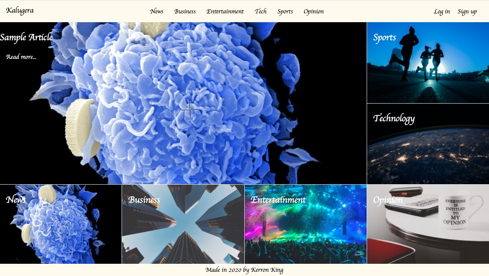

<h1 align="center">Kalugera</h1>
<p align="center">
  <a href="https://www.ruby-lang.org/en/">
    
  </a>
  <a href="http://rubyonrails.org/">
    
  </a>
</p>

<p align="center">
  
</p>

## Table of Contents
- [About](#About)
- [Built With](#built)
- [Live Demo](#demo)
- [Installation and Usage 🚀](#install)
- [Testing](#Testing)
- [Future Work](#Future)
- [Contributing](#Contributing)
- [Show Your Support](#show)
- [Author](#Author)

## About

A simple magazine app built with Ruby on Rails

## Built With <span id="built"></span>

- Ruby on Rails
- RSpec
- Sass
- PostgreSQL
- Heroku

## Live Demo <span id="demo"></span>

Click [here](https://kalugera.herokuapp.com/) to see a live demo of this project.

## Installation and Usage 🚀 <span id="install"></span>

To get started with the app, first clone the repo and cd into the directory:
  
  ```
  $ git clone https://github.com/KerronKing/kalugera.git
  $ cd kalugera
  ```
  
  Then install the needed gems (while skipping any gems needed only in production):
  
  ```
  $ bundle install --without production
  ```
  
  Next, migrate the database:
  
  ```
  $ rails db:migrate
  ```

  Next, seed the database:
  ```
  $ rails db:seed
  ```
  
  Run the app in a local server:
  
  ```
  $ rails server
  ```

  Use the following login credentials for quick access:
  - First Name: Test
  - Last Name: User
  - Email: test@example.com
  - Password: 123456

## Testing

To test the application, cd into the project directory and run the following command in the terminal:
  ```
  $ bundle execute rspec
  ```

## Future Work <span id="future"></span>

Upcoming project upgrades:

- Implement mobile view
- Implement google cloud storage functionality
- Refactor sql queries

## Contributing

Contributions, issues and feature requests are welcome! Feel free to check [issues page](https://github.com/KerronKing/kalugera/issues).

1. Fork the repo
2. Create your working branch (git checkout -b [choose-a-name])
3. Commit your changes (git commit -am 'what this commit will fix/add/improve')
4. Push to the branch (git push origin [chosen-name])
5. Create a new pull request

## Show Your Support <span id="show"></span>

Give a ⭐️ if you like this project!

## Author

:bust_in_silhouette: Kerron King

* Github: [@KerronKing](https://github.com/KerronKing)
* Email: kerronk1989@gmail.com
* Linkedin: [Kerron King](linkedin.com/in/kerron-shawn-king)